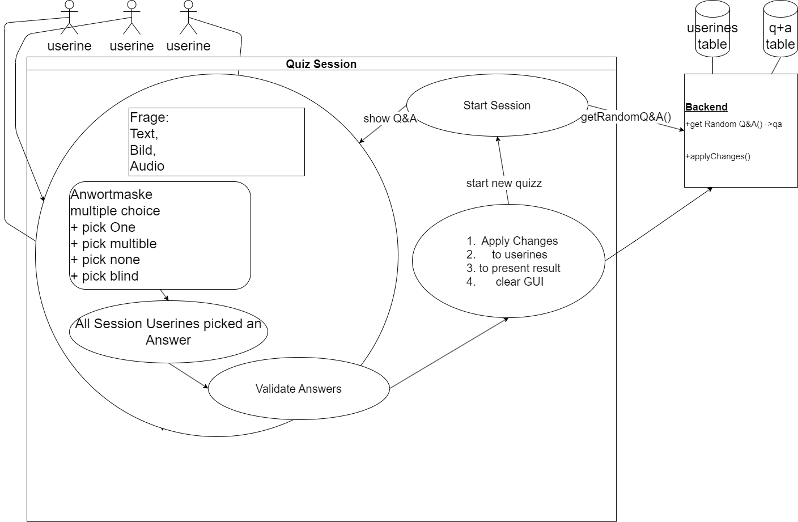

# Quiz App
Tutorial CC: python project with d.kramer and course 

## scratch:  
- source csv with 1200++ questions and answers
- python to db as backend
- python to browser as frontend
- database: To be announced... sqLite, SQL, mongoDB
- gamification: means achievements, lvls, exp, completion awards, free of
- modes:    
     - TrivialPursuit,
     - Jeopardy,
     - Glücksrad,
     - Der Preis ist heiss,
     - 1-2 oder 3
     - competetive: kings1v1, teams2v2, QuizzWarBands30vs30

## qualities:
**priority effectivness:** solid preparation to IHK certificate AP-1, AP-2
### Die Qualitätskriterien für Software als Produkt nach ISO 9126
**Folgende Qualitätsmerkmale werden aufgeführt**  
Unterpunkte sind von mir als relevant sein können eingestuft und aufgeführt

1. Wartbarkeit  
    - Analyse d. Kompenentendokumentation der Entwicklung  
    - Allgemeine Dokumentation -> wiki
    - Modifizierbarkeit -> OOP Entwicklung
    - Testbarkeit -> OOP Testklassen  

2. Benutzbarkeit
    - Responsive Browser frontend -> ff, chrome, edge -> html, css
    - hosted backend to db

3. Effizienz
    - Monitioring -> Antwort- und Verarbeitungszeiten sowie Durchsatz bei der Funktionsausführung.
    - Monitoring -> Ressourcenverbrauch, wie CPU-Zeit, Festplatten-/DB zugriffe,

4. Funktionalität
    - Anforderungsermittlung mittels usecase Diagrammen
    - Zielführende "gamification"
    - DB Anbindung
    - DSGVO konform
    - 

5. Übertragbarkeit
    - Komponenten basierte Entwicklung -> workshops entwickeln Teile welche zur finalen App zusammengebaut werden  
    Bleiben die Komponenten beisamen erhöt dies womöglich die Austauschbarkeit

6. Zuverlässigkeit
    - solide geplante OOP 
    - Wartbarkeit.Testbarkeit Testklassen
    - Monitoring

## Use Case simple
