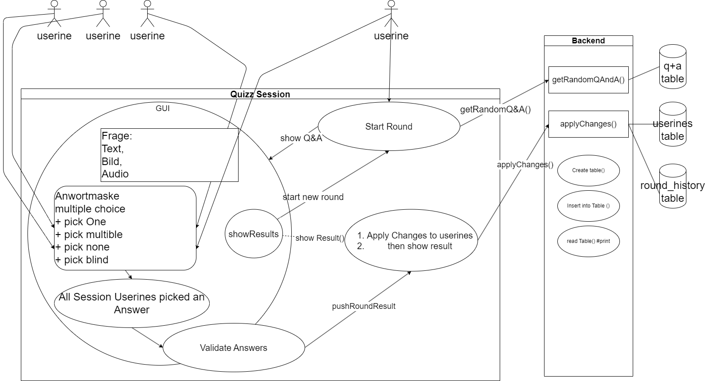

# Quiz App
Tutorial CC: python Projekt: Kurs d.kramer

## Kurs
````
War einmal ein Bumerang;
War ein weniges zu lang.
Bumerang flog ein Stück,
Aber kam nicht mehr zurück.
Publikum — noch stundenlang —
Wartete auf Bumerang.
````

## Umriss 
- eine csv mit 1200++ Fragend and richtiger Antworten  

 TODO: wie sieht es mit falschen Antworten aus für multiple choice?

- python django to db as backend 
- django templates to browser as frontend html, django static css  

TODO: Klären,funktionalität auch python?

- **database**:  sqlite3 integriert in django
- **gamification**: zielführende zur ihk Fachinformatiker AP-1 motivierende punkte oder levels oder archievements oder Bildungscoin gründen und lösen der Aufgaben mined neue Blidungscoins
- Quizart?:    
     - TrivialPursuit,
     - Jeopardy,
     - Glücksrad,
     - Der Preis ist heiss,
     - 1-2 oder 3
     - competetive: kings1v1, teams2v2, QuizzWarBands30vs30


## Softwarequalitäten:
````
Effektivität
Software soll der soliden Vorbereitung auf Wissensfragen zur IHK zertifizierung AP-1, AP-2 dienlich sein
````
### Die Qualitätskriterien für Software als Produkt nach ISO 9126
**Folgende Qualitätsmerkmale werden aufgeführt** 

Unterpunkte sind "work in progress"...

1. Wartbarkeit  
    - Analyse d. Kompenentendokumentation der Entwicklung  
    - Allgemeine Dokumentation -> wiki
    - Modifizierbarkeit -> OOP Entwicklung
    - Testbarkeit -> OOP Testklassen  

2. Benutzbarkeit
    - Responsive Browser frontend -> ff, chrome, edge -> html, css
    - hosted backend to db

3. Effizienz
    - Monitioring -> Antwort- und Verarbeitungszeiten sowie Durchsatz bei der Funktionsausführung.
    - Monitoring -> Ressourcenverbrauch, wie CPU-Zeit, Festplatten-/DB zugriffe,

4. Funktionalität
    - Anforderungsermittlung mittels usecase Diagrammen
    - Zielführende "gamification"
    - DB Anbindung
    - DSGVO konform -> django

5. Übertragbarkeit
    - Komponenten basierte Entwicklung -> workshops entwickeln Teile welche zur finalen App zusammengebaut werden  
    Bleiben die Komponenten beisamen erhöt dies womöglich die Austauschbarkeit

6. Zuverlässigkeit
    - solide geplante OOP 
    - Wartbarkeit.Testbarkeit Testklassen
    - Monitoring


## Use Case simple
